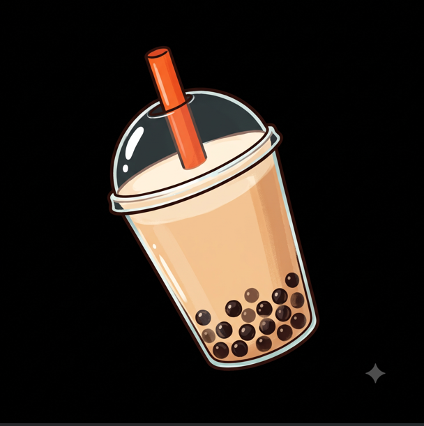

# 🧋 BobaV1

**Fallen Survival Cheat Configurator**

A premium dark-themed configuration dashboard for the BobaV1 cheat script. Configure all settings through a beautiful web UI, then export a loadstring for your executor.



---

## 🚀 Setup

### 1. Fork/Clone This Repo

```bash
git clone https://github.com/boqnpenev1-design/BobaV1.git
```

### 2. Enable GitHub Pages

1. Go to your repo → **Settings** → **Pages**
2. Source: **Deploy from a branch**
3. Branch: `main` → Folder: `/ (root)`
4. Click **Save**
5. Wait ~1 minute, your UI will be live at: `https://boqnpenev1-design.github.io/BobaV1/`

### 3. Update Script URLs

In `boba.lua`, replace `boqnpenev1-design` with your actual GitHub username:

```lua
utility.LoadUrl("https://raw.githubusercontent.com/boqnpenev1-design/BobaV1/main/boba.lua")
```

And for the boba logo:
```lua
return "https://raw.githubusercontent.com/boqnpenev1-design/BobaV1/main/boba.png"
```

### 4. Use In-Game

Open your Fallen executor and paste:

```lua
utility.LoadUrl("https://raw.githubusercontent.com/boqnpenev1-design/BobaV1/main/boba.lua")
```

---

## 📁 Files

| File | Purpose |
|------|---------|
| `index.html` | Main web app shell |
| `style.css` | Dark glassmorphism design system |
| `app.js` | Settings store, tab UI, export logic |
| `boba.lua` | Modified cheat script (loads April + applies mods) |
| `boba.png` | BobaV1 logo |

---

## ✨ Features

### Web UI Tabs
- **Silent Aim** — FOV, bone, hit chance, hitscan, bullet manipulation
- **Gun Mods** — No recoil/spread/sway, fire rate, tracers
- **Visuals** — Player ESP, crosshair, sound ESP, aimbot
- **World** — Resources, farming, animals, loot, NPCs, base ESP
- **Radar** — Minimap, waypoints, raid alerts
- **Misc** — Fly, spider climb, b-hop, anti-aim, desync, autofarm
- **Config** — Reset settings, about page

### Script Modifications
- ❌ AI anime baddie feature **removed**
- 🧋 BobaV1 branding with boba tea logo
- ✅ All original April v4.3.0 features preserved

---

## 🎨 Design

- Dark glassmorphism with frosted panels
- Boba tea warm amber accent (#D4A574)
- Inter + JetBrains Mono typography
- Smooth micro-animations on all controls
- Auto-saving settings via localStorage

---

*Based on April v4.3.0 framework*
